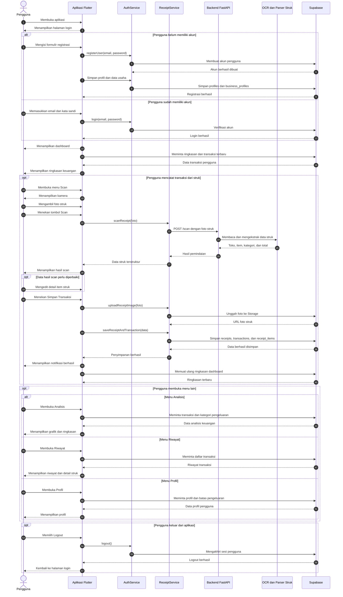

# Sequence Diagram Alur Aplikasi Keuangan UMKM

Diagram berikut menggambarkan interaksi pengguna dengan aplikasi, mulai dari autentikasi sampai pencatatan dan pemantauan transaksi.

```mermaid
sequenceDiagram
    autonumber
    actor User as Pengguna
    participant App as Aplikasi Flutter
    participant Auth as AuthService
    participant Receipt as ReceiptService
    participant API as Backend FastAPI
    participant OCR as OCR dan Parser Struk
    participant DB as Supabase

    User->>App: Membuka aplikasi
    App-->>User: Menampilkan halaman login

    alt Pengguna belum memiliki akun
        User->>App: Mengisi formulir registrasi
        App->>Auth: registerUser(email, password)
        Auth->>DB: Membuat akun pengguna
        DB-->>Auth: Akun berhasil dibuat
        App->>Auth: Simpan profil dan data usaha
        Auth->>DB: Simpan profiles dan business_profiles
        DB-->>App: Registrasi berhasil
    else Pengguna sudah memiliki akun
        User->>App: Memasukkan email dan kata sandi
        App->>Auth: login(email, password)
        Auth->>DB: Verifikasi akun
        DB-->>App: Login berhasil
    end

    App-->>User: Menampilkan dashboard
    App->>DB: Meminta ringkasan dan transaksi terbaru
    DB-->>App: Data transaksi pengguna
    App-->>User: Menampilkan ringkasan keuangan

    opt Pengguna mencatat transaksi dari struk
        User->>App: Membuka menu Scan
        App-->>User: Menampilkan kamera
        User->>App: Mengambil foto struk
        User->>App: Menekan tombol Scan

        App->>Receipt: scanReceipt(foto)
        Receipt->>API: POST /scan dengan foto struk
        API->>OCR: Membaca dan mengekstrak data struk
        OCR-->>API: Toko, item, kategori, dan total
        API-->>Receipt: Hasil pemindaian
        Receipt-->>App: Data struk terstruktur
        App-->>User: Menampilkan hasil scan

        opt Data hasil scan perlu diperbaiki
            User->>App: Mengedit detail item struk
        end

        User->>App: Menekan Simpan Transaksi
        App->>Receipt: uploadReceiptImage(foto)
        Receipt->>DB: Unggah foto ke Storage
        DB-->>Receipt: URL foto struk
        App->>Receipt: saveReceiptAndTransaction(data)
        Receipt->>DB: Simpan receipts, transactions, dan receipt_items
        DB-->>Receipt: Data berhasil disimpan
        Receipt-->>App: Penyimpanan berhasil
        App-->>User: Menampilkan notifikasi berhasil
        App->>DB: Memuat ulang ringkasan dashboard
        DB-->>App: Ringkasan terbaru
    end

    opt Pengguna membuka menu lain
        alt Menu Analisis
            User->>App: Membuka Analisis
            App->>DB: Meminta transaksi dan kategori pengeluaran
            DB-->>App: Data analisis keuangan
            App-->>User: Menampilkan grafik dan ringkasan
        else Menu Riwayat
            User->>App: Membuka Riwayat
            App->>DB: Meminta daftar transaksi
            DB-->>App: Riwayat transaksi
            App-->>User: Menampilkan riwayat dan detail struk
        else Menu Profil
            User->>App: Membuka Profil
            App->>DB: Meminta profil dan batas pengeluaran
            DB-->>App: Data profil pengguna
            App-->>User: Menampilkan profil
        end
    end

    opt Pengguna keluar dari aplikasi
        User->>App: Memilih Logout
        App->>Auth: logout()
        Auth->>DB: Mengakhiri sesi pengguna
        DB-->>App: Logout berhasil
        App-->>User: Kembali ke halaman login
    end
```
